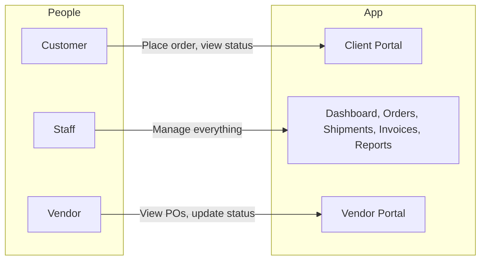
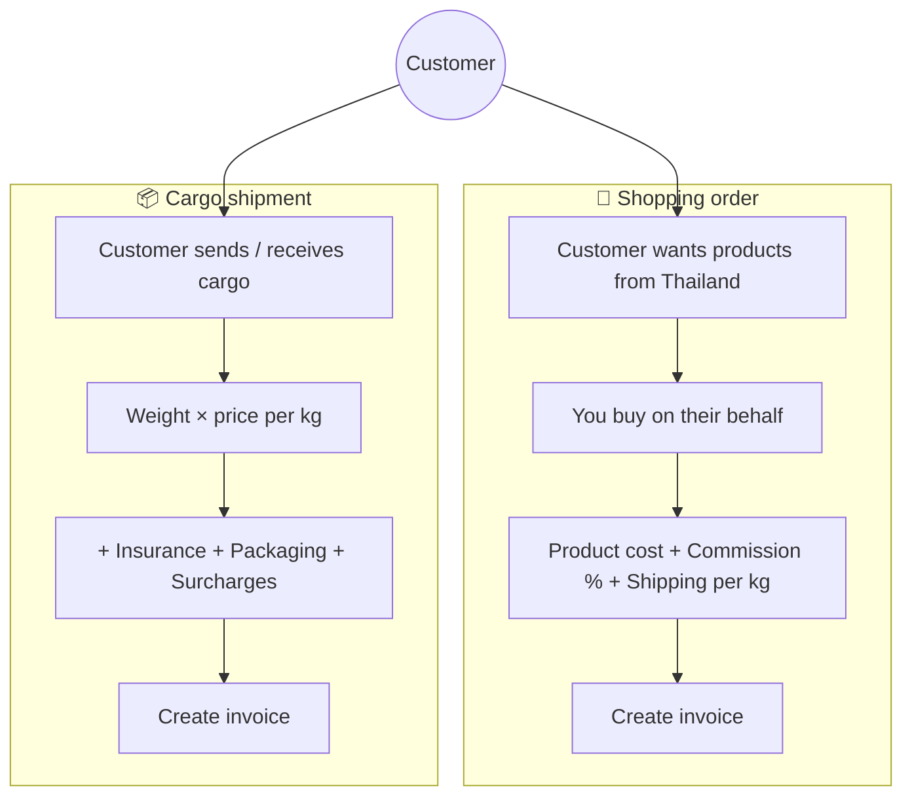
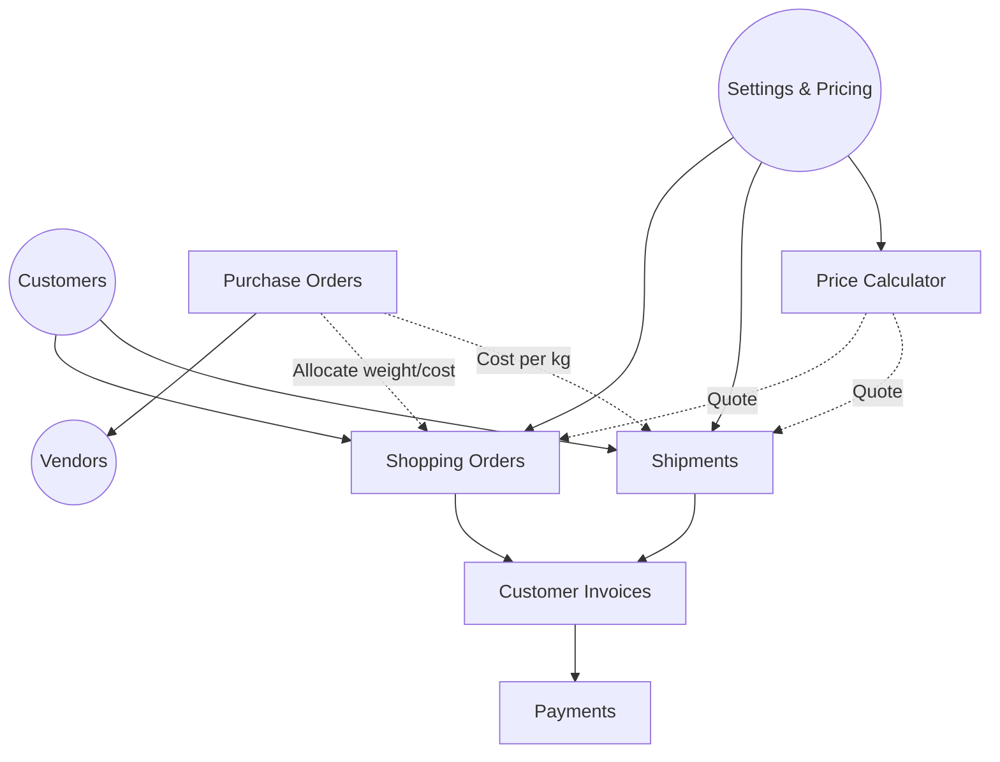
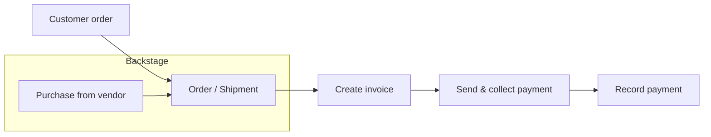

# How the KTM Cargo Express App Works

A simple overview of the app’s structure and main flows.

---

## 1. High-level: Who does what

- **Customers** use the Client Portal to place orders and see status.
- **Staff** use the main app: dashboard, orders, shipments, invoices, reports, settings.
- **Vendors** use the Vendor Portal to see purchase orders and update status.

---

## 2. Two main order types

- **Shopping:** Customer asks you to buy items → you charge **product cost + commission (service fee) + shipping (per kg)** → then create an invoice.
- **Cargo:** Customer has cargo to move → you charge **weight × rate + insurance + packaging (+ surcharges)** → then create an invoice.

---

## 3. How the main pieces connect

- **Customers** are at the centre: they have **Shopping Orders** and **Shipments**.
- **Invoices** are created from Shopping Orders or Shipments; then **Payments** are recorded.
- **Purchase Orders** go to **Vendors**; POs can feed **cost per kg** (and weight) into Shopping Orders and Shipments.
- **Settings & Pricing** drive rates and options for orders, shipments, and the **Price Calculator**.
- The **Price Calculator** is used to get a quote; that quote can be turned into a Shopping Order or Shipment.

---

## 4. Order-to-cash in one picture

1. **Customer order** → create **Order** (shopping) or **Shipment** (cargo).
2. Optionally **purchase from vendor** (PO) and link cost to the order/shipment.
3. **Create invoice** from the order or shipment.
4. **Send invoice** and **collect payment**.
5. **Record payment** in the app.

---

## 5. Where to find things in the app

| What you want to do           | Where in the app      |
|-----------------------------|------------------------|
| Add or edit customers       | **Customers**          |
| Create a shopping order     | **Shopping Orders**    |
| Create a cargo shipment     | **Shipments**          |
| Get a quick quote           | **Price Calculator**    |
| Create an invoice           | **Invoices**           |
| Manage vendor POs           | **Procurement**        |
| Manage vendors              | **Vendors**            |
| Change rates (per kg, etc.) | **Settings → Pricing** |
| See reports                 | **Reports**            |
| Customer self-service       | **Client Portal**      |

---

*Diagrams use [Mermaid](https://mermaid.js.org/). They render in GitHub, GitLab, and many Markdown viewers.*
